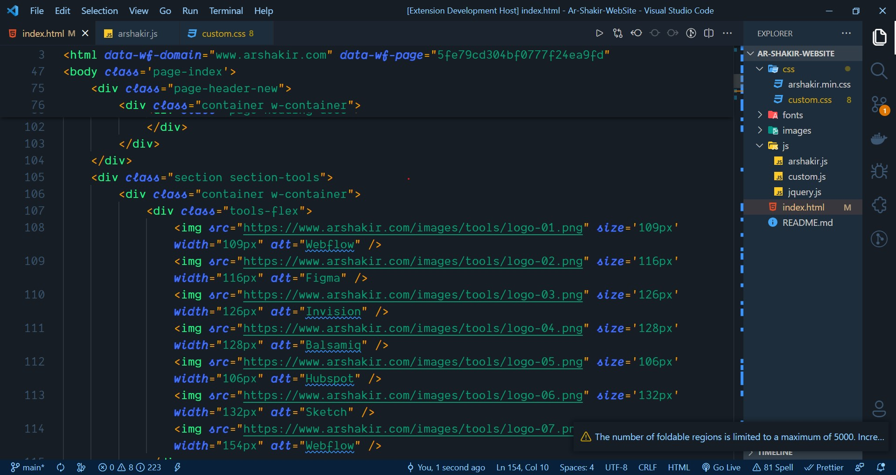

# LiL Yoo Theme for VS Code

Thanks for checking out my VS Code theme. There are 1 options to choose from:

- Colorful & Vibrant

This theme is part of my [programing js](https://vsCodeHero.com)

Let me teach you everything there is to know about VS Code and make you a VS Code SuperHero too!

## Font

The font that you see in the demo is a modified Fira Code font that I made called "STACKr Code".

This font is exclusive to my VS Code SuperHero course. [Sign up now](https://vsCodeHero.com) to get access!

## Installation

1. Open the extensions sidebar on Visual Studio Code
1. Search for codeSTACKr Theme
1. Click Install
1. Click Reload to reload your editor
1. Select the Manage Cog (bottom left) > Color Theme ＞ codeStackr Theme
1. 🌟🌟🌟🌟🌟 Rate five-stars 😃

## Issues & Suggestions

For any issues or suggestions, please use [GitHub issues](https://github.com/codestackr/codestackr-vscode-theme/issues).

## How to make your own theme

Want to learn how to make your own theme?? Check out this video:

