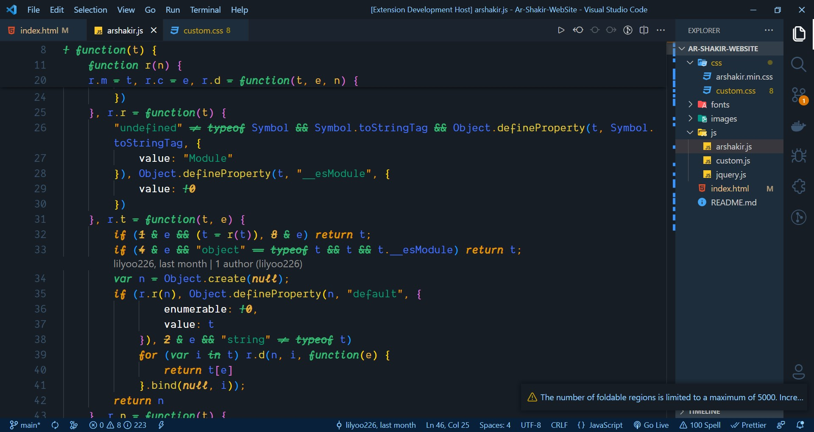
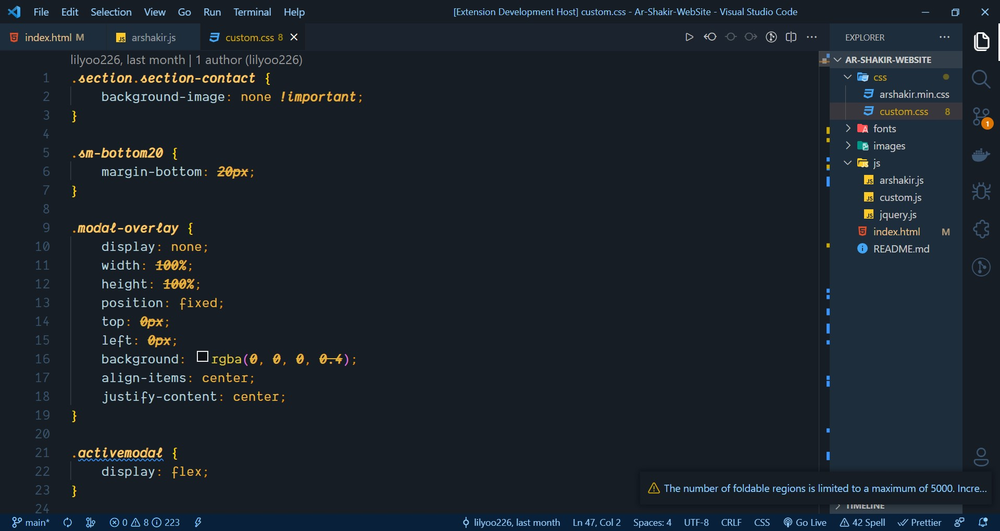

# LiL Yoo Theme for VS Code

Thanks for checking out my VS Code theme. There are 1 options to choose from:

- Colorful & Vibrant

## HTML

## JAVASCRIPT

##CSS

This theme is part of my [programing js](https://github.com/lilyoo226)

## Font

The font that you see in the demo is a modified Monolisa font that is in my github [here](https://github.com/lilyoo226/fonts-vscode)
.

## Installation

1. Open the extensions sidebar on Visual Studio Code
1. Search for Lilyoo Theme
1. Click Install
1. Click Reload to reload your editor
1. Select the Manage Cog (bottom left) > Color Theme ＞ LiLYoo Theme
1. 🌟🌟🌟🌟🌟 Rate five-stars 😃

## Issues & Suggestions

For any issues or suggestions, please use [GitHub issues](https://github.com/lilyoo226/LiL-Yoo-theme/issues).

# new-vscode-theme
